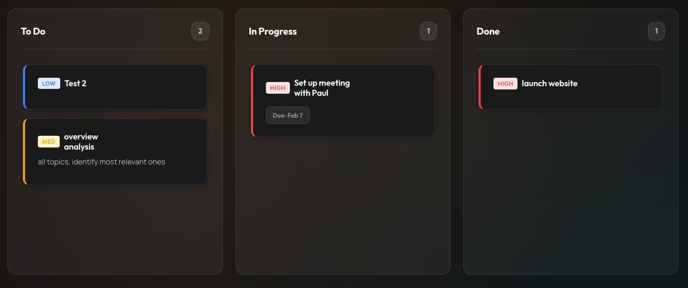
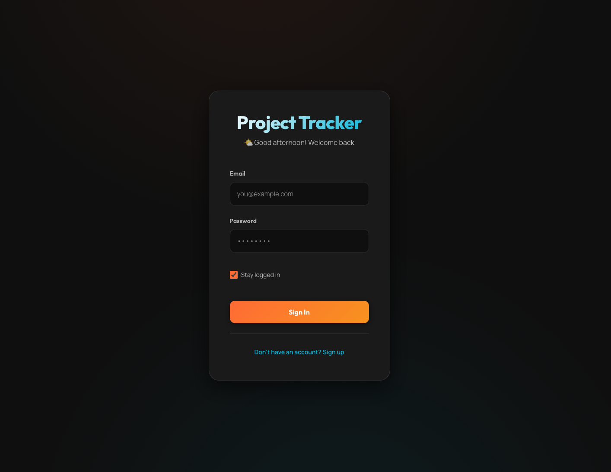
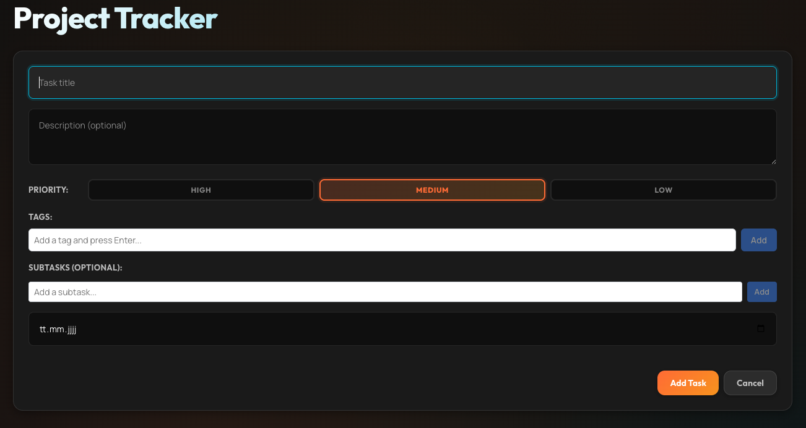
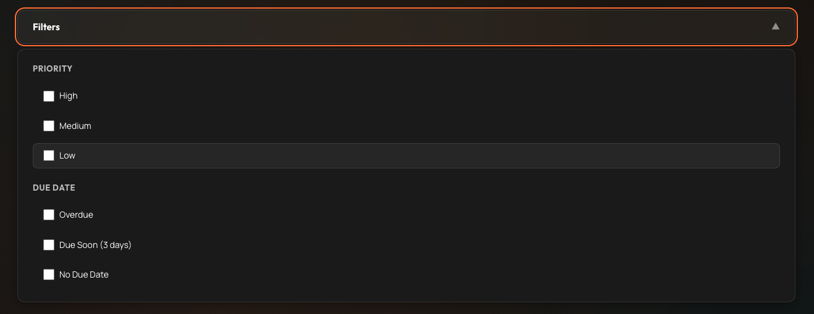

# Project Tracker 🚀

A modern, real-time project management tool designed for personal productivity. Track tasks, capture notes, and stay organized with a beautiful dark theme interface.

  

**Live Demo**: [https://project-tracker-gamma-three.vercel.app](https://project-tracker-gamma-three.vercel.app)

## 📸 Screenshots

### Main Dashboard

*Kanban-style task board with priority levels, tags, and drag-and-drop functionality*

### Authentication

*Secure login with personalized greetings and "Stay logged in" option*

### Task Details

*Rich task cards with priority, tags, subtasks, and due dates*

### Search & Filter

*Advanced filtering by priority, tags, and keywords*

## ✨ Features

### Task Management
- 📋 **Kanban Board**: Organize tasks across To Do, In Progress, and Done columns
- 🎯 **Priority Levels**: Mark tasks as High, Medium, or Low priority with color-coded badges
- 🏷️ **Tags**: Categorize tasks with custom colored tags
- ✅ **Subtasks**: Break down complex tasks into manageable checklist items
- 📅 **Due Dates**: Set and track task deadlines
- 🔍 **Search & Filter**: Find tasks quickly by priority, tags, or keywords

### Quick Notes
- 📝 **Sidebar Notes**: Capture ideas instantly without switching contexts
- ⚡ **Instant Save**: Notes sync in real-time across all your devices

### User Experience
- 🔐 **Secure Authentication**: Personal accounts with email/password
- 👤 **Custom Usernames**: Choose your display name
- 🌓 **Time-based Greetings**: Personalized welcome messages
- 🔄 **Real-time Sync**: Access your data from any device
- 💾 **Auto-save**: Never lose your work
- 🎨 **Premium Dark Theme**: Modern, eye-friendly design with glassmorphism effects

### Security
- 🔒 **Enterprise-grade Password Security**: Strong password requirements with real-time validation
- 🛡️ **Row Level Security (RLS)**: Database-level access control
- 🔑 **Secure Sessions**: Optional "Stay logged in" feature
- ✉️ **Email Verification**: Account confirmation via email

## 🛠️ Tech Stack

- **Frontend**: React 18, CSS Modules
- **Backend**: Supabase (PostgreSQL, Authentication, Real-time subscriptions)
- **Build Tool**: Vite
- **Deployment**: Vercel
- **Fonts**: Outfit (display), Manrope (body)

## 🚀 Getting Started

### Prerequisites

- Node.js 18+ and npm
- Supabase account (free tier works great)

### Installation

1. Clone the repository:
```bash
git clone https://github.com/JanRitzer/ProjectTracker.git
cd ProjectTracker
```

2. Install dependencies:
```bash
npm install
```

3. Set up environment variables:
   - Copy `.env.example` to `.env`
   - Add your Supabase credentials:
```env
VITE_SUPABASE_URL=your_supabase_url
VITE_SUPABASE_ANON_KEY=your_anon_key
```

4. Set up the database:
   - Go to your Supabase project's SQL Editor
   - Run the SQL from `SUPABASE_SETUP.md`
   - Run the SQL from `SUPABASE_USERNAME_UPDATE.md`
   - Configure email redirect URL in Supabase Dashboard

5. Start the development server:
```bash
npm run dev
```

6. Open [http://localhost:5173](http://localhost:5173) in your browser

## 📦 Database Schema

### Tables
- **tasks**: Task data with priority, tags, subtasks, and workspace relationships
- **notes**: Quick notes with real-time sync
- **user_profiles**: User information including custom usernames

### Security
All tables use Row Level Security (RLS) to ensure users can only access their own data.

## 🎨 Design Philosophy

The UI follows a **Modern Editorial meets Neo-Brutalism** aesthetic with:
- Dark background (#0f0f0f) for reduced eye strain
- Orange/cyan/yellow accent colors for visual hierarchy
- Glassmorphism effects for depth
- Smooth animations and micro-interactions
- Generous spacing and bold typography

## 📝 License

MIT License - feel free to use this project for personal or commercial purposes.

## 🤝 Contributing

Contributions are welcome! Feel free to open issues or submit pull requests.

## 👨‍💻 Author

**Jan Ritzer**
- GitHub: [@JanRitzer](https://github.com/JanRitzer)

---

Built with ❤️ using React, Vite, and Supabase
